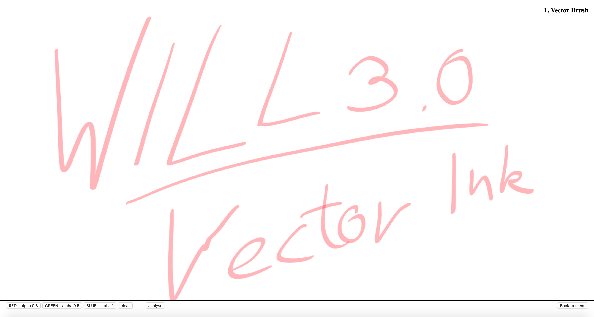
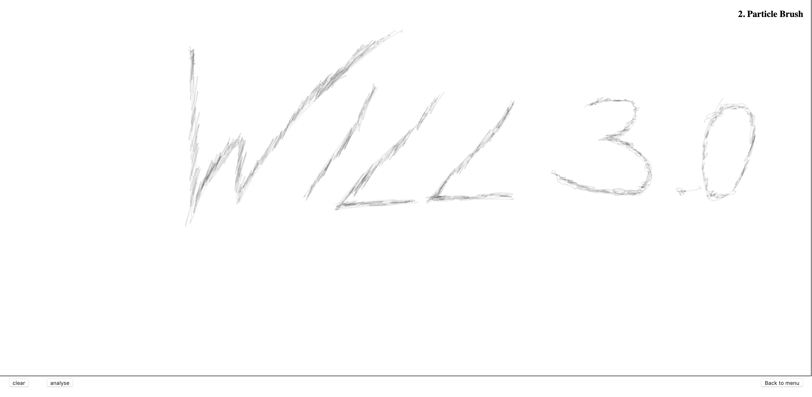
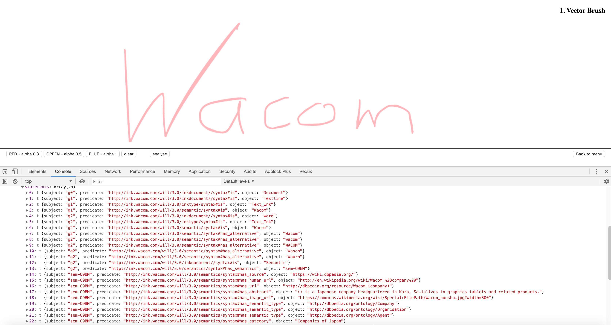

# WILL 3.0 Rendering Demonstration - Web

**NOTICE:**

All of the content provided in this repository is **classified as Wacom Confidential Material**, therefore the signed NON-DISCLOSURE AGREEMENT applies.
Be aware that the **technology components are still under active development** with minimal QA testing, and **API interfaces and functionality could be changed or removed**.

# Description

The sample application demonstrates ink rendering through the use of WILL 3.0 for Ink using a JavaScript implementation.

WILL rendering is split into vector and raster rendering. Vector rendering is a technique that fills the stroke boundary of a path with solid color *(see Figure 1)*


*Figure 1: Screenshot of vector web rendering.*

Raster rendering is a technique that renders strokes using overlapping particles *(see Figure 2)*. This technique allows you to build more expressive tools (such as crayon, pencil, or watercolor brushes).


*Figure 2: Screenshot of raster web rendering.*

Besides the rendering technology this demo illustrates a sample integration of the Semantic Ink technology and its REST API. The *analyse* button triggers the call of the [Semantic Ink REST API](https://github.com/Wacom-Developer/semantic-ink-sample-rest-api).


*Figure 2: Semantic Ink technology integrated within the demo.*

Additional information on the data structures is available in the [WILL 3.0 data format documentation](https://github.com/Wacom-Developer/will3-data-format-specification)

## Ink Geometry Pipeline

The ink geometry pipeline transforms pointer input data to ink geometry.
In the sample application the geometry pipeline is created and configured in the Inking class.
*VectorInking* extends the pipeline for vector 2d rendering.
*RasterInking* is specialized for raster (particle) WebGL rendering.

In order to use the pipeline, you need to create a data layout that specifies the content of the ink paths.
Here is a basic layout where path points have X, Y coordinates and variable size:

```javascript
    var layout = [
        PathPoint.Property.X,
        PathPoint.Property.Y,
        PathPoint.Property.SIZE
    ];
```

The sample application adds more properties (including rotation, scale and offset). See constructors for VectorInking and RasterInking.

### The PathPoint Calculator

The `calculator` is a method that you pass to the `InkBuilder`. It defines how data from pointer events is transformed to path points.
The sample application has two examples of path point calculator methods, they can be found in the *Calculators.js* script. Every method checks for input type - pen, mouse or touch and provides proper data to ink builder.

### Building Ink
In order to build ink in real time you need to handle pointer input events pointerdown, pointermove, pointerup and provide input to the `InkBulder`.
The *On Begin* phase is selected to correspond to pointerType.
`drawPath` updates the canvas on every frame. The `pathPart` provided from ink builder contains two collections - added and predicted (or preliminary) data.
The added data becomes a permanent part of the stroke, while predicted data is temporary and should be displayed only in the current frame.

`BrushPalette` defines some brushes. `InkBuilder` needs to know what brush will be used for rendering.
Vector Inking needs a brush polygon that defines the brush form.
Raster Inking needs the `ParticleBrush` `spacing` property. The `spacing` parameter specifies the distance between different particles along the path trajectory.
The `particles` flag in InkBuilder options is used to point to the kind of rasterization that will be used - for raster inking it should be true.

### Rendering Ink

Once the ink geometry is produced it can be displayed using `StrokeRenderer`. It should be configured in the constructor.
There are two classes - `StrokeRenderer2D` and `StrokeRendererGL` that provide a similar interface.
It takes the parameter canvas which is used as the drawing surface.
The sample application shows efficient rendering of vector ink and particle ink in real time.

Real-time rendering is implemented in the sample application with a technique that uses several layers as raster cache.
The current stroke (added geometry) is stored in a "current stroke" layer. New chunks are rasterized there using `BlendMode.Max`.
The updated rectangle of the "current stroke" layer is copied to a "preliminary stroke" layer.
Then the polygon of the predicted stroke is rendered in the "preliminary stroke" layer, again with `BlendMode.Max`.
The scene "below" the updated area is reconstructed and then the updated piece is copied from the "preliminary stroke" layer to the "scene" layer.
Before presenting, the "scene" layer is copied to the canvas.

In the sample application, collection and rendering of ink is managed by the `StrokeRenderer`:
it creates and maintains the Graphics object and the various Layer objects;
It is configured with a vector brush or raster brush object to handle brush-specific parts of geometry production and rendering;
and receives input which is passed on to an InkBuilder via the Brush.

### Rendering Vector Ink

The output from the geometry pipeline for vector ink is a pair of polygons which are rendered using the draw method of the StrokeRenderer.

### Rendering Particle Ink

The output from the geometry pipeline for raster ink is a pair of interpolated splines - which are actually sequences of interpolated points.
Using the draw method of the StrokeRenderer these sequences can be rendered as particles using a raster brush with shape and fill textures.

---

# Starting the Sample Application

The web based app needs a web server. Python's `SimpleHTTPServer` provides an easy way to get started.
To start the web server, in your commandline run:
```
python -m SimpleHTTPServer 8080 
```
and access the web-demo via:
 *http://localhost:8080/index.html*

---
## Feedback / Support
Participants of the Wacom Beta Program will be provided with optional access to our Slack channel:

- [Slack channel](https://wacom-will.slack.com)

Product Managers and a support engineer will be available in the channel to answer questions and receive valuable feedback.

If you experience issues with the technology components, please file a ticket in our Developer Support Portal:

- [Developer Support Portal](https://developer.wacom.com/developer-dashboard/support)

## Technology Usage
**No Commercial Use**. NOTWITHSTANDING ANYTHING TO THE CONTRARY, THIS AGREEMENT DOES NOT CONVEY ANY LICENSE TO USE THE EVALUATION MATERIALS IN PRODUCTION, OR TO DISTRIBUTE THE EVALUATION MATERIALS TO ANY THIRD PARTY. THE PARTNER ARE REQUIRED TO EXECUTE A SEPARATE LICENSE AGREEMENT WITH WACOM BEFORE MANUFACTURING OR DISTRIBUTING THE EVALUATION MATERIALS OR ANY PRODUCTS THAT CONTAIN THE EVALUATION MATERIALS. The Partner hereby acknowledge and agree that: (i) any use by The Partner of the Evaluation Materials in production, or any other distribution of the Evaluation Materials is a material breach of this Agreement; and (ii) any such unauthorized use or distribution will be at The Partner sole risk. No such unauthorized use or distribution shall impose any liability on Wacom, or any of its licensors, whether by implication, by estoppel, through course of dealing, or otherwise. The Partner hereby agree to indemnify Wacom, its affiliates and licensors against any and all claims, losses, and damages based on The Partner use or distribution of the Evaluation Materials in breach of this Agreement.

---


=======
# inkathon
